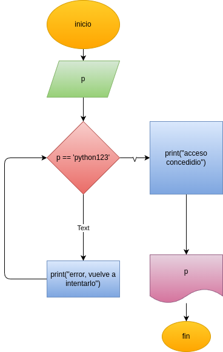

# Programa en python para veerificar la contraseña

## Análisis

### Variables de entrada

- p = password

### Procesamiento

while True:

    p=input("Error, vuelve a intentarlo: ")
    if p == 'python123':
        break
print("")

print("acceso concedido")

print("")

## Diseño

## Construcción

Está en el archivo validador_passwords.py
