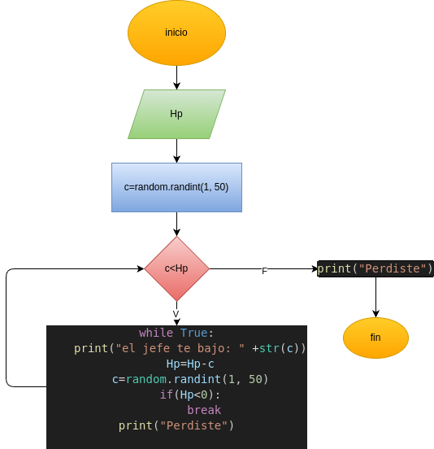

# Programa en python para un jueguito que te baja vida hasta mocharte jajajjajaajajaja

## Análisis

### Variables de entrada

- Hp = vida del personaje

### Procesamiento

while True:

    print("el jefe te bajo: " +str(c))
    Hp=Hp-c
    c=random.randint(1, 50)
    if(Hp<0):

        break
print("Perdiste")

## Diseño

## Construcción

Está en el archivo personaje_HP.py
