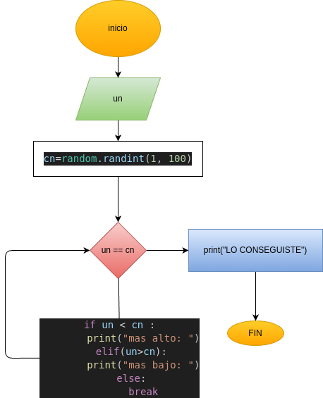

# Programa en python para ADIVINAR EL NUMERO QUE ELIGIO LA COMPUTADORA Y SI FALLAS TE DARA PISTAS HASTA CONSEGUIRLO

## Análisis

### Variables de entrada

- un = numero elegido para adivinar

### Procesamiento
while un != cn:

    un = int(input("Adivina el número (1-100): "))

    if un < cn :

        print("mas alto: ")
    elif(un>cn):

        print("mas bajo: ")
    else:

        break

## Diseño

## Construcción

Está en el archivo adivinar_pistas.py