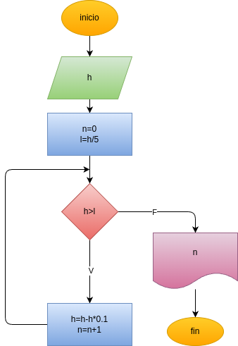

# Programa en python para saber si dependiendo de la altura de donde cae la pelota, determinar hasta donde llega a 1/5 de la altura inicial y en que rebote

## Análisis

### Variables de entrada

- h = numero elegido para la altura

### Procesamiento
while True:

    h=h-(h*0.10)
    n=n+1
    print("rebote, llegó a subir a " +str(h)+str(" metros"))
    print("")
    if(h<l):
    
        break

## Diseño

## Construcción

Está en el archivo pelota_rebote.py