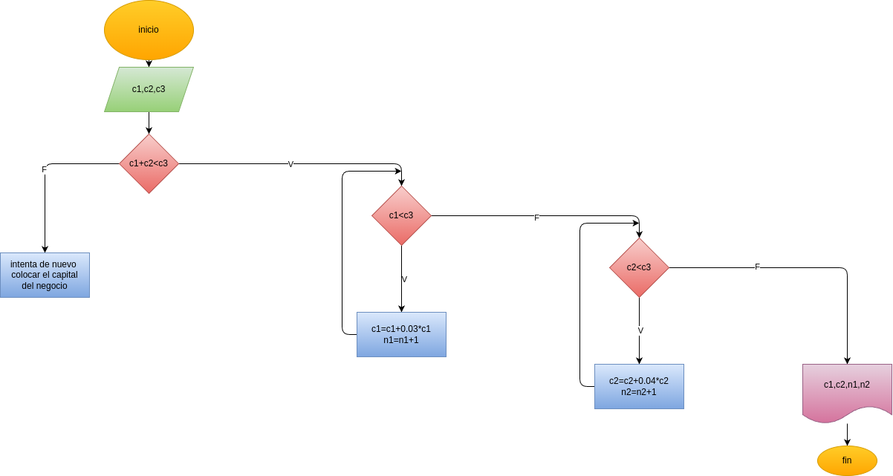

#  Programa en python para que calcule e imprima en cuántos meses, uniendo los dos capitales, pueden hacer el negocio que desean Juan y Pedro

## Análisis

### Variables de entrada

- c1 = capital de Pedro
- c2 = capital de Juan
- c3 = capital del Negocio

### Procesamiento
if c1+c2<c3:

    "ta bien"
else:

    c3=float(input("no sirve, intenta de nuevo colocar el capital del negocio: "))
    print("")

if c3>c2+c1:

    while c1<c3:

        c1=c1+0.03*c1
        n1=n1+1
        if c1>=c3:

            break

    while c2<c3:

        c2=c2+0.04*c2
        n2=n2+1
        if c2>=c3:

            break

## Diseño

## Construcción

Está en el archivo capital_negocio.py